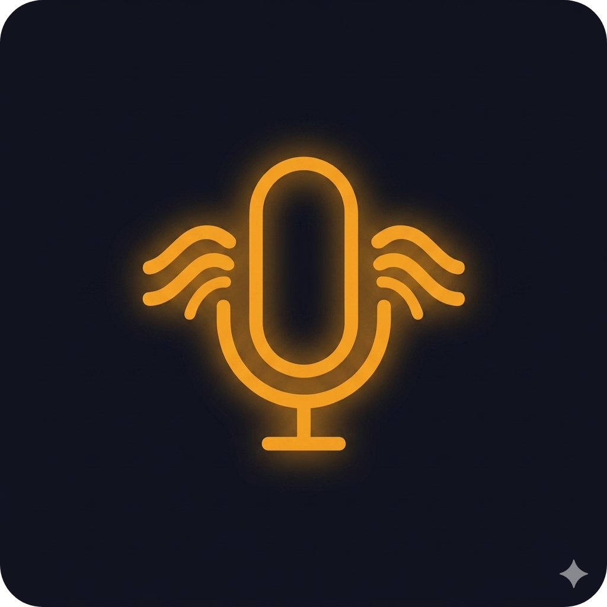

  

# Valoqui (Lingua) - Real-Time AI Spanish Tutor

Valoqui is a high-performance, real-time AI conversation partner designed for immersive language learning. This MVP focuses on **ultra-low latency** voice interactions, utilizing a hybrid on-device/cloud audio pipeline to provide a seamless, human-like speaking experience.

[**Get Started**](docs/ONBOARDING.md) • [**Screenshots**](docs/Screenshots.md) • [**Architecture**](docs/ARCHITECTURE.md) • [**Setup**](docs/SETUP.md) • [**Testing**](docs/testing/TESTING_HANDOFF.md) • [**Contributing**](CONTRIBUTING.md)

---

## 📖 Documentation Map

Welcome to Valoqui! Whether you're here to use the app, understand its design, or contribute, we've got you covered. Start here:

1. 🚀 **[Zero to Hero (Onboarding)](docs/ONBOARDING.md)**: New to the codebase? Start here for a mental model, codebase tour, and your first steps.
2. 📱 **[App Screenshots](docs/Screenshots.md)**: Explore the interface and features of the app through high-fidelity design screenshots.
3. 🛠 **[Developer Setup](docs/SETUP.md)**: A step-by-step guide to setting up your local environment, Firebase, and required models.
4. 🏛 **[Architecture Deep Dive](docs/ARCHITECTURE.md)**: Understand the Feature-First Clean Architecture, the voice pipeline, and state management.
5. 🧠 **[Architectural Decision Records (ADRs)](docs/decisions/README.md)**: Learn *why* decisions were made (e.g., choosing BLoC, Groq, Piper).
6. 📊 **Product Management**: View the [Product Requirements Document (PRD)](docs/planning/PRD.md) and [Sprint Plans](docs/planning/SPRINTS.md) to see how the project is scoped and executed.
7. 📏 **[Coding Standards](docs/CODING_STANDARDS.md)**: The strict technical conventions required when contributing to this codebase.
8. 🧪 **[Testing Strategy](docs/testing/TESTING_HANDOFF.md)**: Learn about our ~95% coverage, testing patterns, and how to write tests for BLoCs.  
   ↳ Latest targeted use-case coverage update: **[Use Case Coverage Expansion (April 2026)](docs/testing/USECASE_COVERAGE_EXPANSION_2026-04.md)**.
9. 🤝 **[Contributing](CONTRIBUTING.md)**: Ready to write code? Read our guidelines for PRs, commits, and codebase rules.

---

## 🚀 Key Technical Achievements

### 1. Ultra-Low Latency Audio Pipeline

To eliminate latency, Valoqui leverages a highly optimized audio stack:

* **VAD (Voice Activity Detection):** Uses on-device **Silero VAD** for accurate segment-based speech detection.
* **STT (Speech-to-Text):** Utilizes on-device **Sherpa-ONNX (Moonshine)** for highly accurate, private transcription.
* **TTS (Text-to-Speech):** Utilizes on-device **VITS/Piper** with a natural Spanish voice (Lucia). Optimized for streaming using a rotating file-cache strategy to prevent stale audio.
* **TTS Warm-Up:** Pre-initializes the TTS engine during LLM generation to overlap initialization with other processing, eliminating 500-2000ms cold start latency (ADR-013).

### 2. High-Performance LLM Orchestration

* **Streaming LLM:** Integrates **Groq (LLaMA 3.3 70B)** for near-instantaneous response generation.
* **Resilient Fallback:** Automatically switches to **Google Gemini 2.0 Flash** if the primary provider fails, ensuring conversation continuity.
* **Sentence-Boundary TTS:** Intelligently triggers TTS playback on sentence boundaries during LLM streaming for a natural human-like cadence.

### 3. Secure Architecture (BYOK)

* **Security First:** Implements a "Bring Your Own Key" (BYOK) model. API keys are stored securely using **Android Keystore / iOS Keychain** via `flutter_secure_storage`.
* **Clean Network Layer:** Custom **Dio interceptors** dynamically inject secure keys into request headers, isolating security logic from business features.

---

## 🛠 Tech Stack

* **Framework:** Flutter (Dart)
* **Architecture:** Feature-First Modular Clean Architecture
* **State Management:** `flutter_bloc` + `freezed` (States) & `Equatable` (Events)
* **Dependency Injection:** `get_it` (Service Locator)
* **Functional Programming:** `fpdart` (using `Either` for robust error handling)
* **Networking:** `dio`
* **Backend:** Firebase (Authentication & Firestore)
* **AI/ML:** Groq (LLM), Gemini (LLM Fallback), Sherpa-ONNX (VAD/STT/TTS)

---

## 👨‍💻 Developer Note

Valoqui was built with a focus on **Software Craftsmanship**. Every design decision—from the use of background isolates for audio processing to the functional error-handling patterns—was made to ensure the system is scalable, testable, and highly performant. 

---

  <i>Project is under MIT <a href="LICENSE">LICENSE</a></i>

