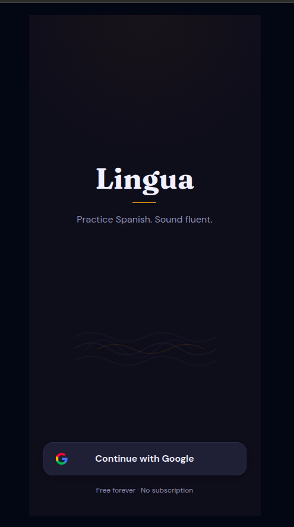
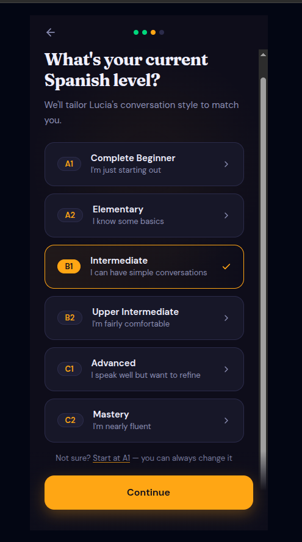
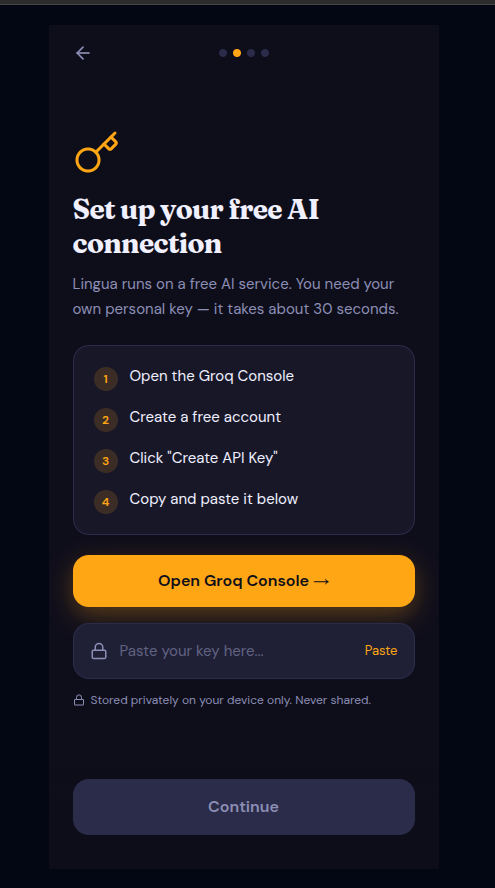
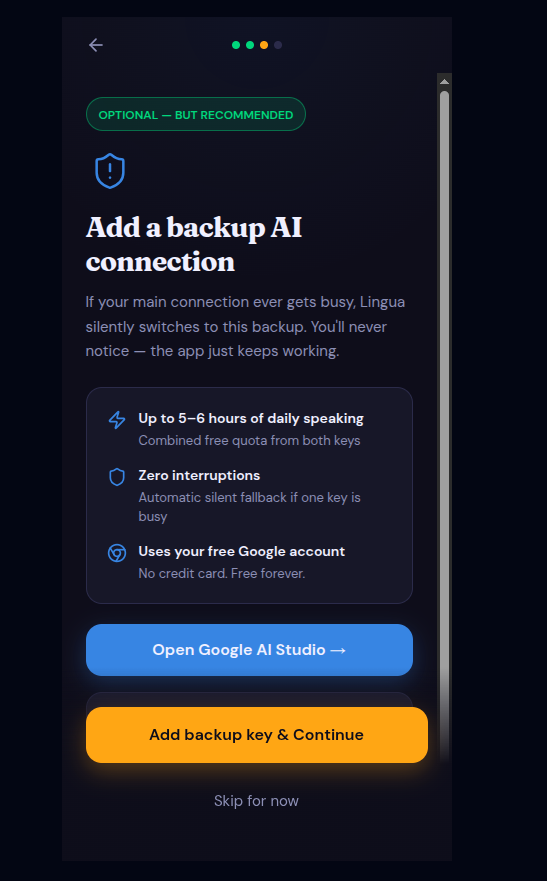
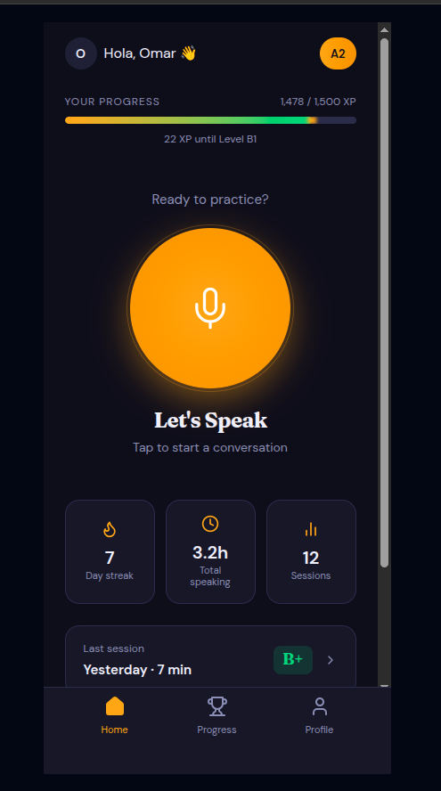
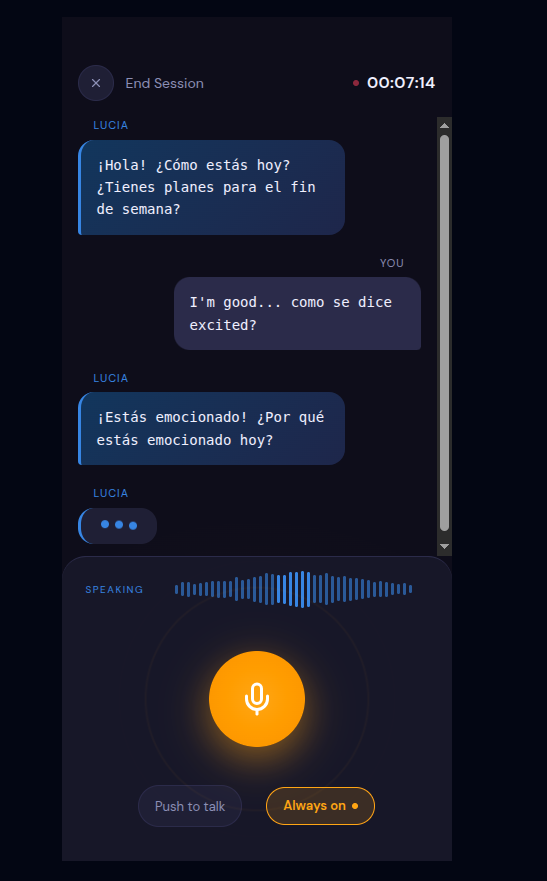
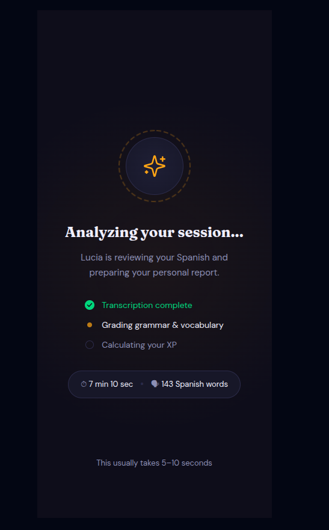
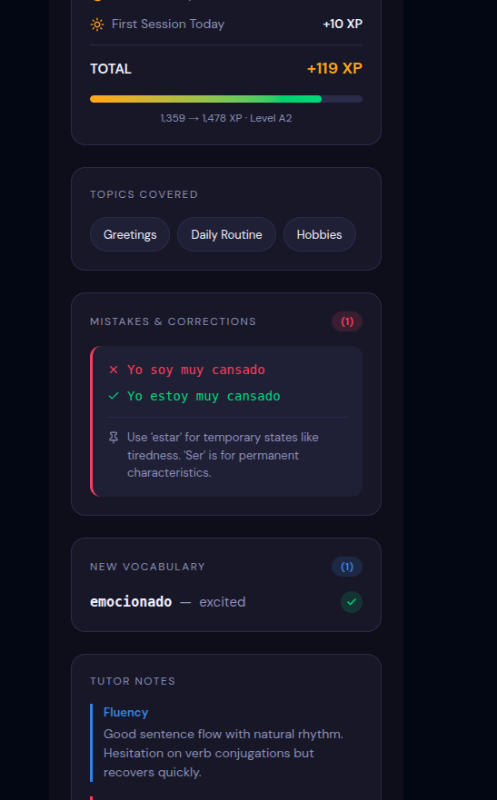
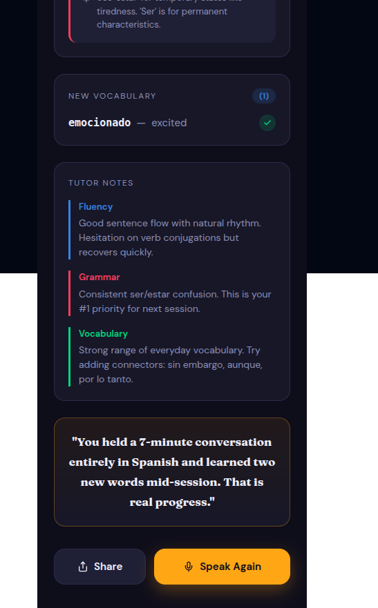

# 📱 Valoqui App Screenshots

Experience the interface of Valoqui, designed for focus and immersive language learning.

---

## 🎨 Design System & Splash

The app features a sophisticated, modern design system optimized for both light and dark modes (MVP currently focuses on a refined dark aesthetic).

| Splash Screen |
| :---: |
|  |

---

## 🚀 Onboarding & Security (BYOK)

The onboarding flow is designed to be transparent and secure, guiding users through the "Bring Your Own Key" setup.

| Select Level | Groq API Key | Gemini API Key (Optional) |
| :---: | :---: | :---: |
|  |  |  |

---

## 💬 Conversational Experience

The heart of Valoqui is the real-time conversation screen, providing visual feedback during the VAD/STT/TTS loop.

| Home Dashboard | Speaking Session |
| :---: | :---: |
|  |  |

---

## 📊 Performance & Reports

After every session, users receive a detailed DELE-aligned report card with actionable feedback.

| Generating Report | Session Report (Summary) | Session Report (Details) |
| :---: | :---: | :---: |
|  |  |  |

---

*Note: All screenshots are taken from the actual Figma design and production application.*
